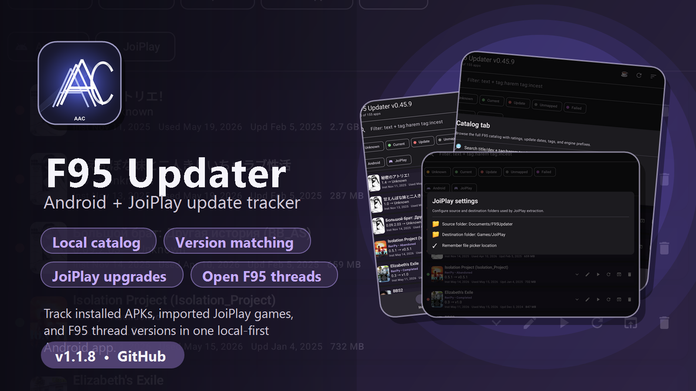
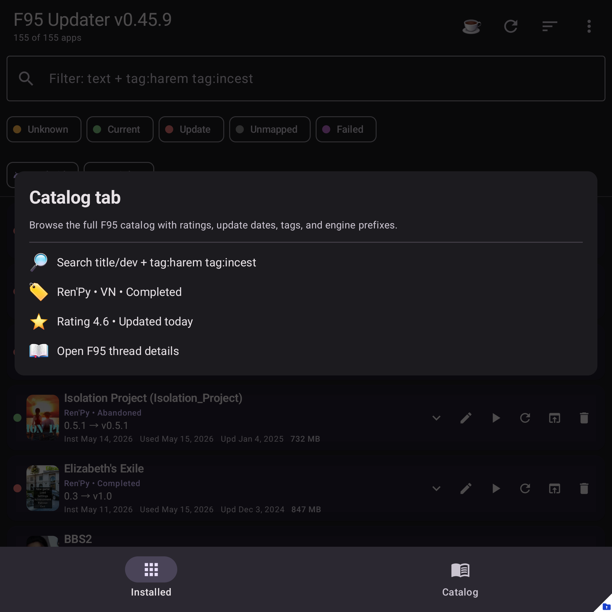
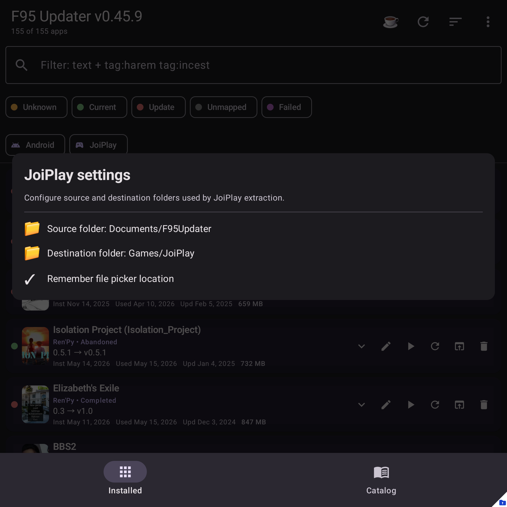

# F95 Updater

  

  
  
  

**F95 Updater** is a local-first Android companion app for tracking F95Zone game updates across installed Android apps and JoiPlay libraries.

It keeps a searchable catalog of F95Zone game threads, matches local apps/games to their threads, compares installed versions with the latest known versions, and opens the right thread when an update is available.

## Download

- **Latest APK:** [GitHub Releases](https://github.com/AdvancedAppCreator/f95updater-releases/releases/latest)
- **Help site:** [advancedappcreator.github.io/f95updater-releases](https://advancedappcreator.github.io/f95updater-releases/)
- **Issues/support:** [GitHub Issues](https://github.com/AdvancedAppCreator/f95updater-releases/issues)

## Highlights

| Feature | What it does |
| --- | --- |
| Android + JoiPlay tracking | Tracks installed APKs and imported JoiPlay games in one list. |
| Local catalog | Search a local F95Zone catalog snapshot by title, developer, tag, status, engine, and rating. |
| Version comparison | Shows installed/current mapping state against the latest known F95 thread version. |
| Manual control | Opens F95Zone threads; it does not download games or bypass file hosts. |
| Install helpers | Handles APK installs and JoiPlay archive installs/upgrades from local files. |
| Backups | Supports app config export/import, JoiPlay `.joiback` imports, and automatic safety backups. |
| Privacy | No analytics SDKs, no ads, and no hosted account required for the app itself. |

## Screenshots

| Main screen | Catalog | JoiPlay settings |
| --- | --- | --- |
|  |  |  |

## What this is not

- It is **not** affiliated with F95Zone, JoiPlay, or any game developer.
- It does **not** download games from F95Zone or bypass third-party file hosts.
- It is **not** distributed through Google Play; install it from GitHub Releases.

## Reporting problems

Open an issue with:

1. Your app version.
2. Android version/device model.
3. What you tapped and what happened.
4. Diagnostics/logs or screenshots if available.

The help site has a short guide for [diagnostics and logs](https://advancedappcreator.github.io/f95updater-releases/diagnostics/logs/).
