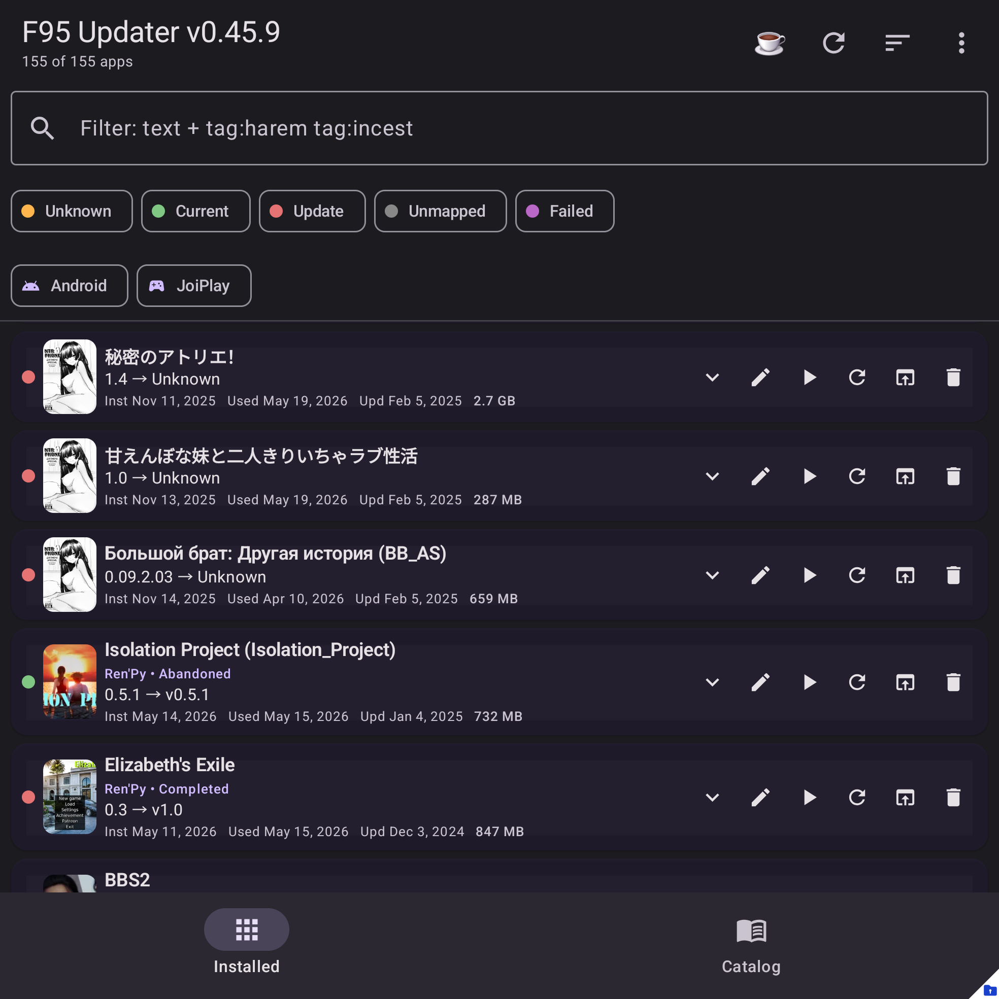

# F95 Updater

The Android companion app for tracking <strong>F95Zone</strong> game updates &mdash; for everything installed on your phone <em>and</em> everything in your JoiPlay library.

<a href="getting-started/" class="md-button md-button--primary">Get started</a>
<a href="https://github.com/AdvancedAppCreator/f95updater-releases/releases/latest" class="md-button">Download latest APK</a>

---

## ✨ What it does

-   :material-database-search:{ .lg .middle } **30,000+ game catalog**

    ---

    Daily-refreshed snapshot of every F95Zone game &mdash; title, version, tags, rating, creator. Searchable offline.

-   :material-magnify-scan:{ .lg .middle } **Auto-match your apps**

    ---

    Scans installed Android apps and JoiPlay games, fuzzy-matches them to F95 threads, and flags anything with a newer version available.

-   :material-android:{ .lg .middle } **Install APKs in-app**

    ---

    Pick an `.apk` &mdash; or pick a `.zip` / `.rar` / `.7z` and we'll extract it, find the APK inside, and hand it to the system installer. Optional auto-cleanup of the source.

-   :material-gamepad-variant:{ .lg .middle } **Install JoiPlay games**

    ---

    Same flow for Ren'Py / RPG Maker / HTML / Tyrano games &mdash; pick the launch file directly, or pick the archive and the app extracts + sends to JoiPlay.

-   :material-folder-zip:{ .lg .middle } **ZIP, RAR (incl. RAR5), 7Z**

    ---

    Password-protected archives supported. Live progress with byte counts. Zip-bomb guards. Native RAR5 extraction via RARLAB unrar on modern devices.

-   :material-tag-multiple:{ .lg .middle } **Powerful catalog search**

    ---

    Search by title or developer. Type `tag:` for autocomplete chips. Filter by status (completed / on-hold / abandoned), engine (RPGM / Ren'Py / Unity / HTML), rating, installed / not-installed.

-   :material-open-in-new:{ .lg .middle } **Direct link to every game**

    ---

    One tap opens the F95Zone thread for any catalog game &mdash; you stay in control of what you download, from where.

-   :material-content-save-cog:{ .lg .middle } **State persists**

    ---

    Filters, sort, search query, last picker folder, hidden apps, custom mappings &mdash; all remembered between sessions.

-   :material-backup-restore:{ .lg .middle } **Backup &amp; restore**

    ---

    Export your full mapping + acknowledgement state to JSON. Import on another phone. Auto-backups before risky operations.

-   :material-update:{ .lg .middle } **Self-update**

    ---

    Built-in updater checks GitHub Releases for new versions and offers a one-tap install.

-   :material-shield-lock-outline:{ .lg .middle } **Your data stays yours**

    ---

    No analytics SDKs. No ads. Cover images load directly from F95's CDN &mdash; nothing is rehosted.

---

## 📖 Help topics

-   :material-rocket-launch-outline:{ .lg .middle } **[Getting started](getting-started.md)**

    ---

    First launch, importing your JoiPlay backup, letting the catalog match your apps.

-   :material-home-outline:{ .lg .middle } **[Main screen tour](main-screen.md)**

    ---

    Row icons, color-coded status, filter bar, search, multi-select, the action menu.

-   :material-link-variant:{ .lg .middle } **[Mapping apps to F95](mapping/auto-match.md)**

    ---

    Auto-match, manual search, paste a thread URL, mark "Not on F95", change a wrong match.

-   :material-database-sync:{ .lg .middle } **[Catalog](catalog/sync.md)**

    ---

    How the daily catalog works, the in-tab refresh button, tag autocomplete, auto-hide non-games.

-   :material-gamepad-variant-outline:{ .lg .middle } **[Install games & APKs](joiplay/install-apk.md)**

    ---

    Install APKs, install games in JoiPlay, JoiPlay settings, delete game folders.

-   :material-archive-outline:{ .lg .middle } **[Backup &amp; restore](backup/export-import.md)**

    ---

    Export / import mapping state, import JoiPlay `.joiback` backups, auto-backups.

-   :material-help-circle-outline:{ .lg .middle } **[FAQ](faq.md)**

    ---

    Common questions and troubleshooting.

---

## What this app **isn't**

- ❌ **It does not download or auto-install game APKs from F95.** You always go through F95Zone to fetch new builds yourself.
- ❌ **It is not affiliated with F95Zone or JoiPlay.** All trademarks and copyrights remain with their owners.
- ❌ **It is not on Google Play.** Sideload from [GitHub Releases](https://github.com/AdvancedAppCreator/f95updater-releases/releases/latest).

## Reporting a problem

If something looks off, capture screenshots and write down what you tapped, then open an issue or post in the [F95Zone support thread](https://github.com/AdvancedAppCreator/f95updater-releases/issues).
