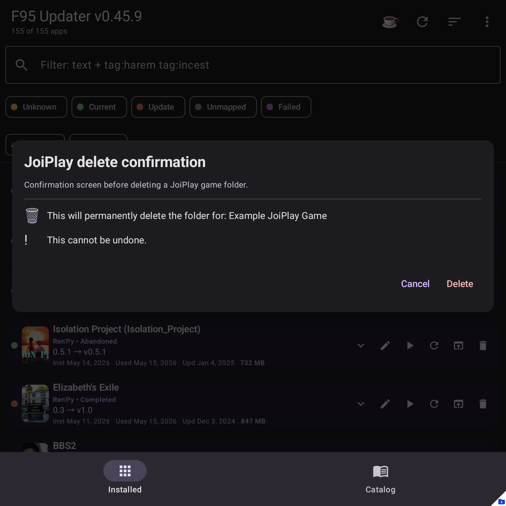

# Delete a JoiPlay game

Removes the game's folder from disk and hides the row from the app. Use this
to clean up games you no longer want.

## Prerequisites

- **All-files access** must be granted. The first delete will prompt you to grant it via **Menu → Install → JoiPlay settings…**.

## How to delete

1. Tap the **🗑** icon on the JoiPlay row.
2. Confirm in the **Delete JoiPlay game?** dialog.
3. A spinner dialog appears while the folder is being removed (large games
   can take several seconds).
4. Snackbar: `Deleted <game title>`.

## Persistence

After a successful delete, the game's ID is added to a "deleted games" set
inside the app. Even though the imported `.joiback` snapshot still lists the
game, our app filters it out so it doesn't reappear on next launch.

## Startup prune of missing folders

On every app launch, the app walks all imported JoiPlay games and checks if
their folder still exists on disk. If a folder is definitely gone the game is auto-marked deleted — the same as if you'd tapped 🗑.

This catches:

- Games you deleted via a file manager outside our app.
- Games removed in JoiPlay's own UI.
- Games left over from older `.joiback` imports.

Games we can't reach (e.g. in a different storage area without permission)
are left alone — we don't false-prune.

## Troubleshooting

- **"Delete failed — folder no longer accessible"** — the All-files access permission has been revoked, or the path lies in a profile our app can't see (e.g. Samsung Secure Folder). Re-grant via **JoiPlay settings…** and retry.
