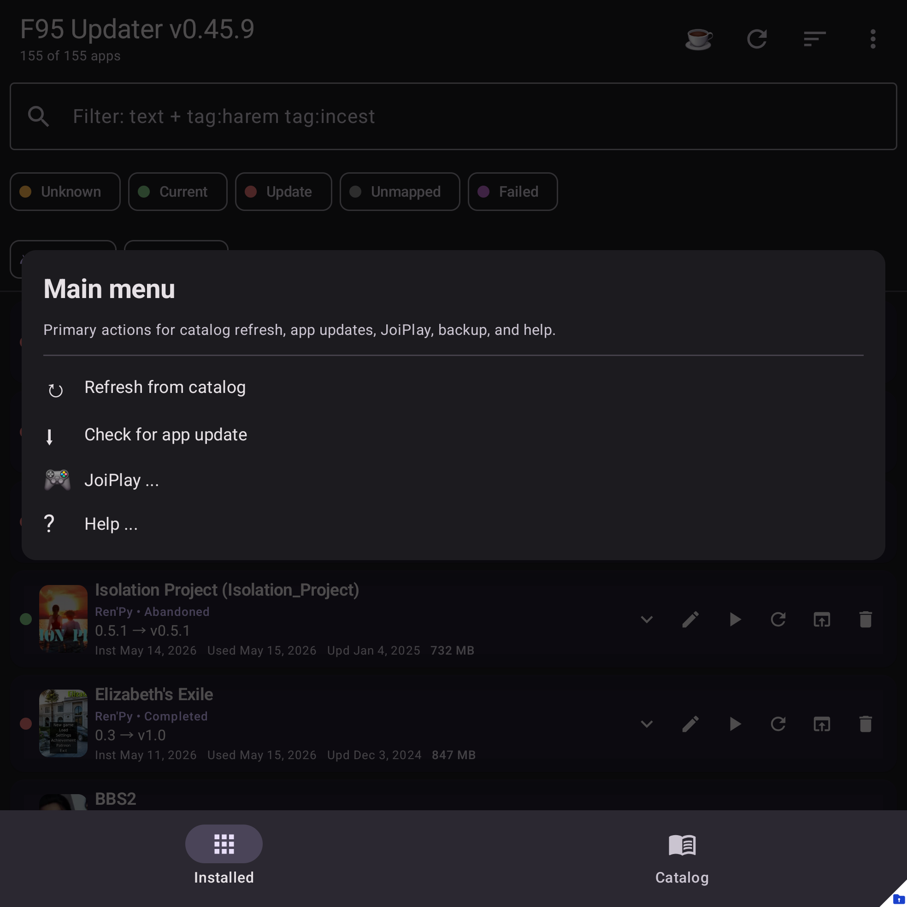

# Main screen tour

## The row card

Each row represents one tracked app — either an Android-installed app or a
JoiPlay game.

From left to right:

- **Status dot** – color tells you the app state at a glance:
    - 🟢 **Green** – up to date (installed version matches latest F95 version).
    - 🔴 **Red** – update available.
    - 🟠 **Orange** – unknown (haven't checked yet, or version not yet parsed).
    - ⚪ **Gray** – not mapped to any F95 thread.
    - 🟣 **Purple** – last check failed.
- **Cover thumbnail** – the F95 game's cover image (when mapped). Tap to see
  the full-size cover.
- **App name** – the label as Android (or JoiPlay) sees it.
- **F95 title** – shown on a second line when the catalog title differs from
  the local label, so you always know which game we matched.
- **Versions** – `<installed> → <latest>`.
- **Personal labels** – if set, your status/rating/notes marker appears under
  the version line, for example `Playing • Rating 4/5 • Notes`.
- **Install / last-used / size** – small metadata row.

### Row icons (right side)

| Icon | Meaning |
|---|---|
| **▾ / ▴** | Expand / collapse the details panel. |
| **✏️** | Open [Edit mapping](mapping/manual-search.md). |
| **▶** | Launch the app (or open the JoiPlay game). |
| **🔄** | Re-check just this row against F95. |
| **🌐 / 🔍** | Open the mapped thread (or open a search if not yet mapped). |
| **🗑** | Uninstall Android app / delete JoiPlay folder. |

## Top bar

- **Title** – shows the app version, plus a small counter (`X of Y apps`).
- **☕** – Support the project. Hidden if no donation URL is configured, and
  moved into the overflow menu on narrow/landscape layouts.
- **🔄** – Refresh all (checks every mapped row against F95).
- **⋮** – Main menu (Install, Catalog, Backup & config, Help).

## Filter & search

Below the top bar:

- **Search box** – free-text filter over app names. Supports tag-search syntax
  like `myth tag:harem tag:incest` (matches names containing "myth" that have
  both tags). While typing `tag:<prefix>` you'll see **autocomplete chips** below the field — tap a chip to insert the full tag name.
- **Status filter chips** – toggle rows by Update / Current / Unknown /
  Unmapped / Failed.
- **Manual-only filter** – show manual/external matches when you are reviewing
  mapping decisions.
- **Source filter** – Android only / JoiPlay only / Both.

On short landscape screens and narrow foldable layouts, filters compact into
single-row controls and some row actions move behind overflow menus to preserve
space.

## Main menu

The overflow menu contains:

- **Refresh from catalog** — re-match all rows against the local catalog.
- **Check for app update** — force the self-updater check.
- **Show hidden apps / Show visible apps** — switch between visible and hidden
  rows.
- **Catalog** — sync the catalog, review unmapped games, control manual-match
  overwrite behavior, auto-hide non-games, and reset acknowledgements.
- **Install** — install APKs, install JoiPlay games, and open JoiPlay settings.
- **Backup & config** — export/import backups, import `.joiback` files, scan
  probably-unused JoiPlay folders, and restore auto-backups.
- **Grant/Revoke all files access** and **Grant/Revoke usage data access** —
  open the relevant Android settings pages.
- **Help** — documentation, About, app sharing, issue reporting, diagnostics,
  logs, and support links.

When diagnostics are enabled, a floating screenshot button is visible over the
app. Dialogs that need it have their own screenshot button inside the dialog.

## Multi-select

**Long-press** any row to enter multi-select mode:

- A toolbar appears at the top of the list showing `N selected`, with **All /
  Clear** and **Hide** (or **Unhide** when you're already viewing hidden apps).
- **Tap** any other row to add or remove it from the selection.
- The **×** on the left exits multi-select.
- Selected rows get a tinted background so they're easy to see.

<!-- screenshot: main-screen-multiselect.png -->

Multi-select is the fastest way to bulk-hide non-game apps that
[Auto-hide non-games](catalog/auto-hide.md) didn't catch.

## Showing hidden apps

Menu → **Show hidden apps**. The title bar switches to "Hidden (N)" and the
list is now your hidden apps. Long-press to multi-select and tap **Unhide** to
bring them back.
