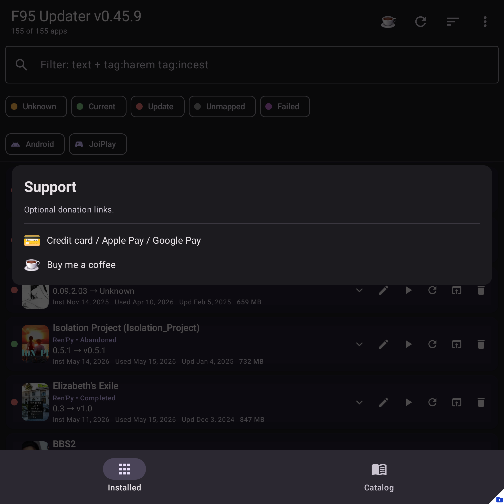

# Support the project

F95 Updater is **free**. If you find it useful and want to
chip in to keep development going, two donation options are wired into the
app.

## How to find them

- Tap the **☕ icon** in the top-right of the main screen.
- Or open the menu → **Help → Support the project**.

When both options are configured, you'll see a chooser dialog. Pick whichever
is easier for you — both go to the same developer.

## Option 1: Credit card / Apple Pay / Google Pay (Stripe)

Opens a Stripe-hosted Payment Link in your browser. You can:

- Pay any amount you like (the page asks how many "tip" units of $1 each).
- Use any major credit/debit card, Apple Pay, Google Pay, Cash App Pay,
  Klarna, Amazon Pay, or Link (Stripe's saved-card feature).
- Currency is automatically converted to your local currency where
  supported (Stripe Adaptive Pricing).

No account required. The transaction shows up on your statement as
`ADVANCED APP CREATOR`.

## Option 2: Buy me a coffee

Opens [buymeacoffee.com/advancedappcreator](https://buymeacoffee.com/advancedappcreator)
in your browser. You can sign in (or check out as a guest) and tip in
"coffee" units of a few dollars each.
